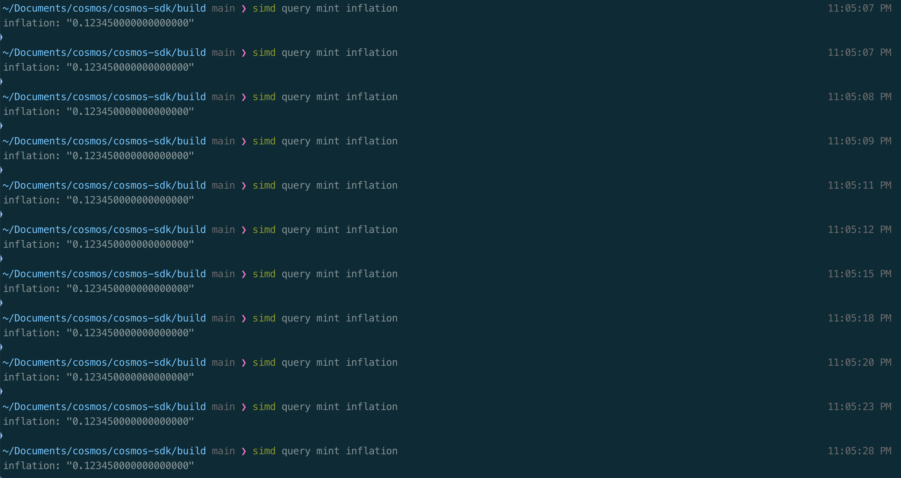
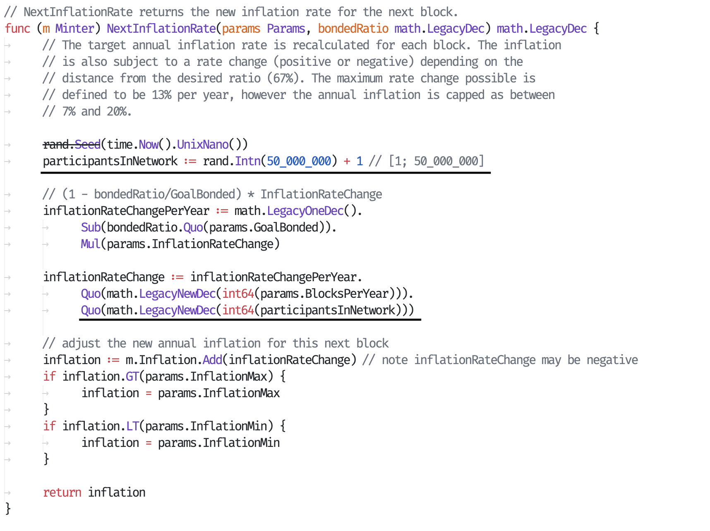

# Cosmos

## Task 

This challenge consists of modifying the inflation model for Cosmos SDK. The task is as follows:
1. Set up a local node of the test application from the Cosmos SDK repository (SimApp, please refer to the link below)
2. Execute some transactions and show how inflation is changing
3. Play with the minting module: change the inflation mechanism to be
    a. Static (not changing over time)
    b. Changing depending on the arbitrary parameters you like (please explain the mechanics here)
4. Show how inflation is changing after updating the mechanism
  
Should you have any questions, feel free to refer to the following documents:
Test application (SimApp): https://github.com/cosmos/cosmos-sdk/tree/main/simapp.  
How run a node: https://docs.cosmos.network/v0.50/user/run-node/run-node.  
Mining module documentation: https://docs.cosmos.network/main/build/modules/mint.  
And one ADR, which is optional, just to have a feeling of the task: https://github.com/celestiaorg/celestia-app/blob/main/docs/architecture/adr-019-strict-inflation-schedule.md.  

## Startup. Set up a local node of the test application from the Cosmos SDK repository. 
Create working directory
``` 
simd init some-random-moniker --chain-id my-test-chain
```

##
Create new key
```
simd keys add alice-wallet

ALICE_WALLET=$(simd keys show alice-wallet -a)
```

##
Adding genesis accounts
```
simd genesis add-genesis-account $ALICE_WALLET 100000000000stake
```
*скрина нет, но я выполнял, правда*
##
Add validators
```
simd genesis gentx alice-wallet 1000000000stake --chain-id my-test-chain
```  
Add gentx to the common genesis.json file
```
simd genesis collect-gentxs
```

##
Start node
```
simd start
```


## Transaction interacting. Execute some transactions and show how inflation is changing  

Get balance by address
```
simd query bank balances $ALICE_WALLET
```

##
Create another receiver to understand how transactions work
```
simd keys add bob-wallet

BOB_WALLET=$(simd keys show bob-wallet -a)
```

##
Send 'money' from Alice to Bob. Also there are unsigned transactions. They are excuted with `--generate-only` flag and sign later with `simd tx sign` command.
```
simd tx bank send $ALICE_WALLET $BOB_WALLET 1000000stake --chain-id my-test-chain
```


##
Delegate some of the stake tokens sent to the Bob account to the validator
```
simd tx staking delegate $(simd keys show alice-wallet --bech val -a) 500stake --from bob-wallet --chain-id my-test-chain
```

##
Query the total delegations to `validator`.
```
simd query staking delegations-to $(simd keys show alice-wallet --bech val -a --keyring-backend test)
```
  
## How inflation depends on transactions

  

## Inflation tasks. Change the inflation mechanism 
Mechanic of the inflation growth described in `NextInflationRate` method.
### Constant inflation
To make inflation constant you can modify `genesis.json` file. Changed parameters: `inflation`, `inflation_rate_change`. New value of `inflation` is custom, `inflation_rate_change` was set to 0.  
  
  
### Changing depending on the arbitrary parameters you(me) like
Task **3.b.** is not clear for me. I decided to make inflation depends on 'participants'. The more users there are, the greater the inflation. Here you can see that inflation changing is not constant. It's clearly visible on last two blocks.  
  

## Codebase 

**x/mint/types/minter.go**  
  
Here easy to understand why `inflation_rate_change` was changed to 0(commented formula)  
```
func (m Minter) NextInflationRate(params Params, bondedRatio math.LegacyDec) math.LegacyDec {
	// The target annual inflation rate is recalculated for each block. The inflation
	// is also subject to a rate change (positive or negative) depending on the
	// distance from the desired ratio (67%). The maximum rate change possible is
	// defined to be 13% per year, however the annual inflation is capped as between
	// 7% and 20%.

	// (1 - bondedRatio/GoalBonded) * InflationRateChange
	inflationRateChangePerYear := math.LegacyOneDec().
		Sub(bondedRatio.Quo(params.GoalBonded)).
		Mul(params.InflationRateChange)
	inflationRateChange := inflationRateChangePerYear.Quo(math.LegacyNewDec(int64(params.BlocksPerYear)))

	// adjust the new annual inflation for this next block
	inflation := m.Inflation.Add(inflationRateChange) // note inflationRateChange may be negative
	if inflation.GT(params.InflationMax) {
		inflation = params.InflationMax
	}
	if inflation.LT(params.InflationMin) {
		inflation = params.InflationMin
	}

	return inflation
}
```
##

**x/mint/types/params.go**  
  
This constructor is used to initialize params with values from genesis.json(as I understand)
```
func NewParams(mintDenom string, inflationRateChange, inflationMax, inflationMin, goalBonded math.LegacyDec, blocksPerYear uint64, maxSupply math.Int) Params {
	return Params{
		MintDenom:           mintDenom,
		InflationRateChange: inflationRateChange,
		InflationMax:        inflationMax,
		InflationMin:        inflationMin,
		GoalBonded:          goalBonded,
		BlocksPerYear:       blocksPerYear,
		MaxSupply:           maxSupply,
	}
}
```
## Conclusion

Growth of inflation directly depends on the frequency of transactions and the amount of data (coins) transferred
